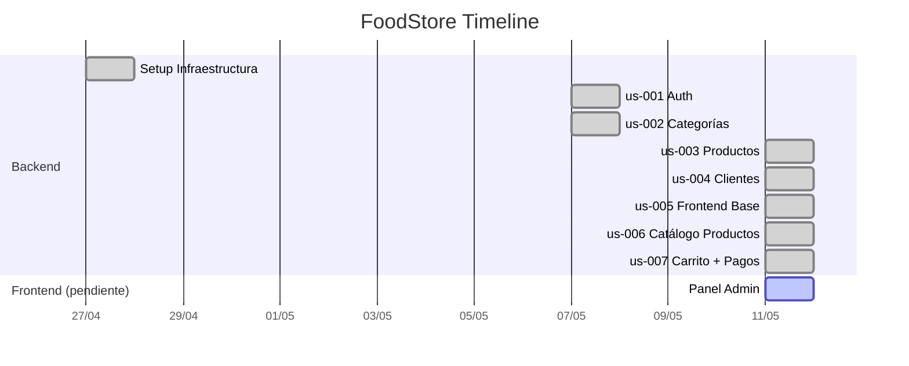

# FoodStore — Mapa de Changes

> Documentación de cambios completados y roadmap de cambios futuros.
> Generado: 2026-05-11

---

## Completados



| Change | Fecha | Descripción | Tasks |
|--------|-------|-------------|-------|
| `setup-infrastructure` | 2026-04-27 | Fundación del proyecto: FastAPI app, config, DB engine, seed data, core utilities, estructura feature-first, Alembic | — |
| `us-001-auth` | 2026-05-07 | Sistema de autenticación completo: registro, login JWT, refresh tokens con rotation, roles (ADMIN/CLIENT/STOCK/PEDIDOS), RBAC (`require_role`), rate limiting | 33 |
| `us-002-categorias` | 2026-05-07 | CRUD de categorías de productos: modelo, API REST, seed data, soft-delete | — |
| `us-003-productos` | 2026-05-11 | CRUD de productos: modelo con FK a categoría, filtro por categoría, paginación, soft-delete | — |
| `us-004-clientes` | 2026-05-11 | CRUD de clientes: modelo independiente de usuario, vinculación por email, CLIENT solo accede a su registro, ADMIN full | 17 |
| `us-005-frontend-base` | 2026-05-11 | Frontend base: Vite + React + TS + TailwindCSS, routing, auth UI, layouts, axios interceptors | 35 |
| `us-006-frontend-productos` | 2026-05-11 | Catálogo frontend: grilla, paginación, filtro por categoría, detalle de producto, productos destacados | 19 |
| `us-007-frontend-carrito` | 2026-05-11 | Flujo de compra completo: carrito, checkout, pedidos, pagos simulado, direcciones frontend | 40 |

### Módulos del backend

| Módulo | Estado | Change | Endpoints |
|--------|--------|--------|-----------|
| `auth/` | ✅ | us-001-auth | POST /register, /login, GET /me |
| `refreshtokens/` | ✅ | us-001-auth | POST /refresh, /logout |
| `usuarios/` | ✅ | us-001-auth | CRUD usuarios |
| `admin/` | ✅ | us-001-auth | Gestión admin |
| `categorias/` | ✅ | us-002-categorias | CRUD /api/v1/categorias |
| `productos/` | ✅ | us-003-productos | CRUD /api/v1/productos |
| `clientes/` | ✅ | us-004-clientes | CRUD + /me /api/v1/clientes |
| `frontend/` | ✅ | us-005-frontend-base | SPA con Vite + React + TS + TailwindCSS |
| `frontend/src/pages/` | ✅ | us-006-frontend-productos | Catálogo, detalle, destacados en home |
| `pedidos/` | ✅ | us-007-frontend-carrito | CRUD /api/v1/pedidos |
| `pagos/` | ✅ | us-007-frontend-carrito | Pago MercadoPago /api/v1/pagos |
| `direcciones/` | ✅ | us-007-frontend-carrito | CRUD /api/v1/direcciones |
| `frontend cart/` | ✅ | us-007-frontend-carrito | Carrito, checkout, pedidos, direcciones frontend |

---

## Roadmap Futuro

```
FRONTEND (Vite + React + TypeScript)
══════════════════════════════════════════════════════════════

us-005 ──▶ us-006 ──▶ us-007 ──▶ us-009
  │                    │
  └──▶ us-008 ─────────┘
         │
         └── admin panel

INFRA + TESTS
═════════════
us-010 ── Docker Compose
us-011 ── Tests automatizados
```

### us-005-frontend-base 🔴 Alta

**Dependencias**: ninguna  
**Tasks estimadas**: 8-10  
**Descripción**: Scaffolding del frontend + flujo de autenticación + layout base.

```
Vite + React + TypeScript + TailwindCSS
├── react-router-dom     → /login, /register, / (layout), /admin/*
├── axios + interceptors → API client con refresh automático
├── Zustand / Context    → auth state management
├── Componentes base:
│   ├── ProtectedRoute   → redirect si no hay sesión
│   ├── AdminRoute       → redirect si no es ADMIN
│   ├── Layout           → navbar + sidebar + main area
│   └── ApiClient        → axios instance con JWT interceptor
```

**Escenarios clave**:
- Usuario se registra → 201 + tokens guardados
- Usuario inicia sesión → redirect a home con datos del usuario
- Token expirado → refresh automático o redirect a login
- Usuario no autenticado → redirect a /login

---

### us-006-frontend-productos 🔴 Alta

**Dependencias**: us-005-frontend-base  
**Tasks estimadas**: 5-6  
**Descripción**: Catálogo público de productos con navegación.

```
/public              → home con destacados
/productos           → grilla paginada con filtro por categoría
/productos/:id       → detalle: imagen, precio, descripción, botón "Agregar al carrito"
```

**Escenarios clave**:
- Usuario ve catálogo sin auth (endpoint público)
- Filtra productos por categoría
- Paginación funcionando

---

### us-008-frontend-admin 🟡 Media

**Dependencias**: us-005-frontend-base  
**Tasks estimadas**: 8-10  
**Descripción**: Panel de administración con CRUDs y dashboard.

```
/admin               → dashboard con stats (pedidos hoy, ingresos, clientes)
/admin/productos     → CRUD con tabla + formularios
/admin/categorias    → CRUD categorías
/admin/clientes      → listado de clientes
/admin/pedidos       → listado + cambio de estado
```

**Escenarios clave**:
- Solo rol ADMIN puede acceder
- CRUD completo de productos y categorías
- Gestión de pedidos (cambiar estado: pendiente → confirmado → ... → entregado)

---

### us-009-frontend-perfil 🟡 Media

**Dependencias**: us-005-frontend-base  
**Tasks estimadas**: 4-5  
**Descripción**: Perfil del usuario y gestión de direcciones.

```
/perfil              → ver/editar nombre, email, teléfono
/perfil/direcciones  → CRUD direcciones de envío
```

**Escenarios clave**:
- Usuario ve y edita su perfil
- CRUD de direcciones asociadas al usuario

---

### us-010-docker 🟢 Baja

**Dependencias**: ninguna  
**Tasks estimadas**: 4-5  
**Descripción**: Entorno local con Docker Compose.

```yaml
docker-compose.yml
├── api        → backend FastAPI + Uvicorn
├── db         → PostgreSQL 16
└── frontend   → Vite dev server
```

---

### us-011-tests 🟢 Baja

**Dependencias**: ninguna  
**Tasks estimadas**: 8-10  
**Descripción**: Tests automatizados para backend y frontend.

```
Backend:
├── tests/unit/       → servicios, repositorios
├── tests/integration → API endpoints
├── pytest + pytest-asyncio + httpx
└── Base de datos de test separada

Frontend:
├── Vitest + Testing Library
├── tests de componentes (login form, product card, etc.)
└── tests e2e con Playwright
```

---

## Resumen

| # | Change | Prioridad | Deps | Tasks | Estado |
|---|--------|-----------|------|-------|--------|
| — | `setup-infrastructure` | — | — | — | ✅ Archivado |
| — | `us-001-auth` | — | infra | 33 | ✅ Archivado |
| — | `us-002-categorias` | — | auth | — | ✅ Archivado |
| — | `us-003-productos` | — | auth, cat | — | ✅ Archivado |
| — | `us-004-clientes` | — | auth | 17 | ✅ Archivado |
| us-005 | Frontend base | 🔴 Alta | — | 35 | ✅ Archivado |
| us-006 | Catálogo productos | 🔴 Alta | us-005 | 19 | ✅ Archivado |
| us-007 | Carrito + pagos | 🔴 Alta | us-005, us-006 | 40 | ✅ Archivado |
| us-008 | Panel admin | 🟡 Media | us-005 | 8-10 | ⏳ Pendiente |
| us-009 | Perfil + direcciones | 🟡 Media | us-005 | 4-5 | ⏳ Pendiente |
| us-010 | Docker | 🟢 Baja | — | 4-5 | ⏳ Pendiente |
| us-011 | Tests | 🟢 Baja | — | 8-10 | ⏳ Pendiente |
