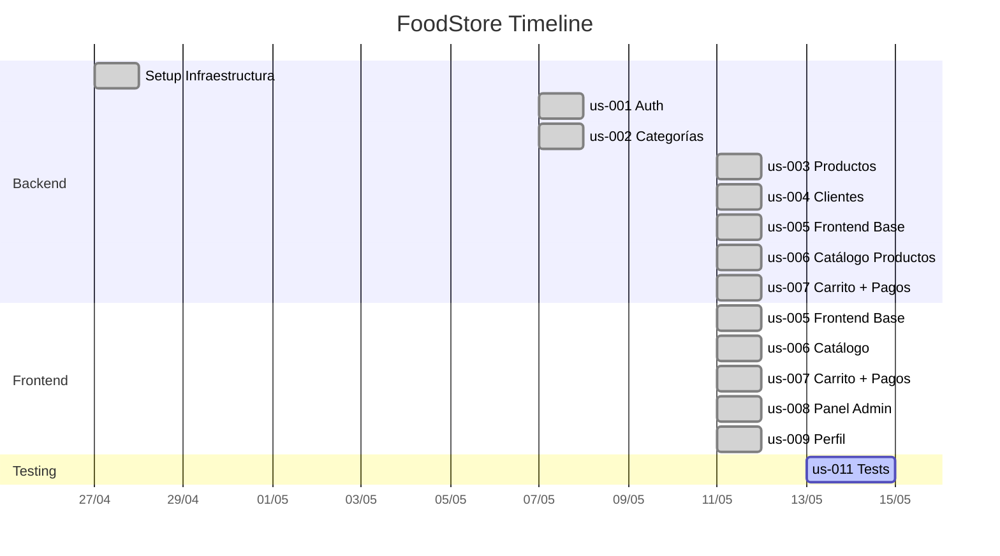

# FoodStore — Mapa de Changes

> Documentación de cambios completados y roadmap de cambios futuros.
> Generado: 2026-05-13
> NOTA: us-010-docker revertido — el proyecto corre localmente con PostgreSQL directo

---

## Completados



| Change | Fecha | Descripción | Tasks |
|--------|-------|-------------|-------|
| `setup-infrastructure` | 2026-04-27 | Fundación del proyecto: FastAPI app, config, DB engine, seed data, core utilities, estructura feature-first, Alembic | — |
| `us-001-auth` | 2026-05-07 | Sistema de autenticación completo: registro, login JWT, refresh tokens con rotation, roles (ADMIN/CLIENT/STOCK/PEDIDOS), RBAC (`require_role`), rate limiting | 33 |
| `us-002-categorias` | 2026-05-07 | CRUD de categorías de productos: modelo, API REST, seed data, soft-delete | — |
| `us-003-productos` | 2026-05-11 | CRUD de productos: modelo con FK a categoría, filtro por categoría, paginación, soft-delete | — |
| `us-004-clientes` | 2026-05-11 | CRUD de clientes: modelo independiente de usuario, vinculación por email, CLIENT solo accede a su registro, ADMIN full | 17 |
| `us-005-frontend-base` | 2026-05-11 | Frontend base: Vite + React + TS + TailwindCSS, routing, auth UI, layouts, axios interceptors | 35 |
| `us-006-frontend-productos` | 2026-05-11 | Catálogo frontend: grilla, paginación, filtro por categoría, detalle de producto, productos destacados | 19 |
| `us-007-frontend-carrito` | 2026-05-11 | Flujo de compra completo: carrito, checkout, pedidos, pagos simulado, direcciones frontend | 40 |
| `us-008-frontend-admin` | 2026-05-11 | Panel admin: dashboard con métricas, CRUD productos/categorías/clientes/pedidos | 40 |
| `us-009-frontend-perfil` | 2026-05-11 | Perfil de usuario + gestión de direcciones | 17 |

### Módulos del backend

| Módulo | Estado | Change | Endpoints |
|--------|--------|--------|-----------|
| `auth/` | ✅ | us-001-auth | POST /register, /login, GET /me |
| `refreshtokens/` | ✅ | us-001-auth | POST /refresh, /logout |
| `usuarios/` | ✅ | us-001-auth | CRUD usuarios |
| `admin/` | ✅ | us-001-auth | Gestión admin |
| `categorias/` | ✅ | us-002-categorias | CRUD /api/v1/categorias |
| `productos/` | ✅ | us-003-productos | CRUD /api/v1/productos |
| `clientes/` | ✅ | us-004-clientes | CRUD + /me /api/v1/clientes |
| `frontend/` | ✅ | us-005-frontend-base | SPA con Vite + React + TS + TailwindCSS |
| `frontend/src/pages/` | ✅ | us-006-frontend-productos | Catálogo, detalle, destacados en home |
| `pedidos/` | ✅ | us-007-frontend-carrito | CRUD /api/v1/pedidos |
| `pagos/` | ✅ | us-007-frontend-carrito | Pago MercadoPago /api/v1/pagos |
| `direcciones/` | ✅ | us-007-frontend-carrito | CRUD /api/v1/direcciones |
| `frontend cart/` | ✅ | us-007-frontend-carrito | Carrito, checkout, pedidos, direcciones frontend |
| `frontend admin/` | ✅ | us-008-frontend-admin | Panel admin: dashboard, CRUD productos/categorías/clientes/pedidos |
| `frontend perfil/` | ✅ | us-009-frontend-perfil | Perfil + edición de datos personales |

---

## Roadmap Futuro

```
FRONTEND (Vite + React + TypeScript)
══════════════════════════════════════════════════════════════

us-005 ──▶ us-006 ──▶ us-007 ──▶ us-009
  │                    │
  └──▶ us-008 ─────────┘
         │
         └── admin panel

TESTS
═════
us-011 ── Tests automatizados
```

### us-005-frontend-base 🔴 Alta

**Dependencias**: ninguna  
**Tasks estimadas**: 8-10  
**Descripción**: Scaffolding del frontend + flujo de autenticación + layout base.

```
Vite + React + TypeScript + TailwindCSS
├── react-router-dom     → /login, /register, / (layout), /admin/*
├── axios + interceptors → API client con refresh automático
├── Zustand / Context    → auth state management
├── Componentes base:
│   ├── ProtectedRoute   → redirect si no hay sesión
│   ├── AdminRoute       → redirect si no es ADMIN
│   ├── Layout           → navbar + sidebar + main area
│   └── ApiClient        → axios instance con JWT interceptor
```

**Escenarios clave**:
- Usuario se registra → 201 + tokens guardados
- Usuario inicia sesión → redirect a home con datos del usuario
- Token expirado → refresh automático o redirect a login
- Usuario no autenticado → redirect a /login

---

### us-006-frontend-productos 🔴 Alta

**Dependencias**: us-005-frontend-base  
**Tasks estimadas**: 5-6  
**Descripción**: Catálogo público de productos con navegación.

```
/public              → home con destacados
/productos           → grilla paginada con filtro por categoría
/productos/:id       → detalle: imagen, precio, descripción, botón "Agregar al carrito"
```

**Escenarios clave**:
- Usuario ve catálogo sin auth (endpoint público)
- Filtra productos por categoría
- Paginación funcionando

---

### us-008-frontend-admin 🟡 Media

**Dependencias**: us-005-frontend-base  
**Tasks estimadas**: 8-10  
**Descripción**: Panel de administración con CRUDs y dashboard.

```
/admin               → dashboard con stats (pedidos hoy, ingresos, clientes)
/admin/productos     → CRUD con tabla + formularios
/admin/categorias    → CRUD categorías
/admin/clientes      → listado de clientes
/admin/pedidos       → listado + cambio de estado
```

**Escenarios clave**:
- Solo rol ADMIN puede acceder
- CRUD completo de productos y categorías
- Gestión de pedidos (cambiar estado: pendiente → confirmado → ... → entregado)

---

### us-009-frontend-perfil 🟡 Media

**Dependencias**: us-005-frontend-base  
**Tasks estimadas**: 4-5  
**Descripción**: Perfil del usuario y gestión de direcciones.

```
/perfil              → ver/editar nombre, email, teléfono
/perfil/direcciones  → CRUD direcciones de envío
```

**Escenarios clave**:
- Usuario ve y edita su perfil
- CRUD de direcciones asociadas al usuario

---

### us-011-tests 🟢 Baja

**Dependencias**: ninguna  
**Tasks estimadas**: 8-10  
**Descripción**: Tests automatizados para backend y frontend.

```
Backend:
├── tests/unit/       → servicios, repositorios
├── tests/integration → API endpoints
├── pytest + pytest-asyncio + httpx
└── Base de datos de test separada

Frontend:
├── Vitest + Testing Library
├── tests de componentes (login form, product card, etc.)
└── tests e2e con Playwright
```

---

## Planificados (Nuevos Changes)

```
FRONTEND (Vite + React + TypeScript)
══════════════════════════════════════════════════════════════
align-with-spec ─── ingredients-module ─── ux-polish
       │
       └─── complete-order-fsm
       │
       └─── admin-enhancements
       │
       └─── enhance-auth-rbac

BACKEND (FastAPI + PostgreSQL)
══════════════════════════════════════════════════════════════
complete-order-fsm ─── ingredients-module
       │
       └─── admin-enhancements
       │
       └─── enhance-auth-rbac
```

### 1. `align-with-spec` 🔴 Alta

**Dependencias**: cambios activos (mp-integration, fix-core-purchase-flow, us-011-test)  
**Descripción**: Cerrar brecha con la especificación técnica v5.0. Migrar a TanStack Query, implementar 4 stores Zustand, recharts, HistorialEstadoPedido, snapshot pattern, stock management, reorganizar a FSD.

```
TanStack Query
├── useQuery/useMutation para todo fetching
├── queryKeys descriptivos + invalidación automática
├── Eliminar useEffect para datos de servidor
└── Hooks por dominio (useProductos, usePedidos, useAdmin)

Zustand 4 stores
├── authStore ✅ (existente)
├── cartStore ✅ (existente)
├── paymentStore 🆕 (estado del pago)
└── uiStore 🆕 (tema, toasts, sidebar)

Dashboard
├── recharts: ingresos semanales (línea)
├── recharts: pedidos por estado (torta)
└── recharts: top 5 productos (barras)

HistorialEstadoPedido
├── Modelo + repository
├── Registro automático en cada transición
└── Append-only (solo INSERT)

Snapshots + Stock
├── precio_snapshot en DetallePedido
├── direccion_snapshot en Pedido
├── Stock decrement al CONFIRMAR
└── Stock restore al CANCELAR

Feature-Sliced Design
├── shared/ (UI, API, types, utils)
├── entities/ (producto, pedido, cliente)
├── features/ (auth, cart, checkout, admin)
├── widgets/ (ProductGrid, CartDrawer, OrderTimeline)
└── pages/ (cada página importa de widgets/features)
```

---

### 2. `ingredients-module` 🔴 Alta

**Dependencias**: `align-with-spec` (deseable, no blocking)  
**Descripción**: Implementar el módulo de ingredientes y alérgenos con CRUD completo, asociación a productos, y visualización en frontend.

```
Backend
├── Modelo Ingrediente (nombre, es_alergeno, activo)
├── Tabla ProductoIngrediente (M2M + es_removible)
├── CRUD /api/v1/ingredientes
├── POST/DELETE /api/v1/productos/{id}/ingredientes
└── Seed data con ingredientes comunes

Frontend
├── Admin: CRUD de ingredientes
├── ProductDetailPage: ingredientes + badge alérgeno
├── ProductListPage: filtro por exclusión de alérgenos
└── Badge visual para alérgenos
```

---

### 3. `complete-order-fsm` 🟡 Media

**Dependencias**: `align-with-spec` (bloqueante — necesita HistorialEstadoPedido y stock management)  
**Descripción**: Completar la máquina de estados del pedido con historial append-only, stock atómico, cancelación por cliente, y timeline visual.

```
Backend
├── HistorialEstadoPedido (append-only)
├── Stock decrement atómico al CONFIRMAR
├── Stock restore atómico al CANCELAR
├── Endpoint cancelar para CLIENT (solo PENDIENTE)

Frontend
├── Timeline visual en OrderDetailPage
├── Botón "Cancelar pedido" (CLIENT, estado PENDIENTE)
└── Transiciones completas en admin
```

---

### 4. `admin-enhancements` 🟡 Media

**Dependencias**: `align-with-spec` (recharts), `enhance-auth-rbac` (roles)  
**Descripción**: Completar el panel de administración con CRUD de usuarios, gráficos, gestión de stock, filtros avanzados y exportación.

```
Dashboard
├── Gráficos recharts (ingresos, pedidos, top productos)
└── Cards de métricas existentes

CRUD Usuarios
├── Listar, crear, editar, desactivar
├── Asignar roles (ADMIN, STOCK, PEDIDOS, CLIENT)
└── Modal de confirmación

Gestión stock
├── Campo editable inline en tabla productos
├── PATCH /api/v1/productos/{id}/stock

Pedidos avanzado
├── Filtros: fecha, estado, búsqueda por ID
├── Exportar a CSV

UX admin
├── Modales de confirmación en acciones destructivas
├── Skeletons en tablas
└── Estados vacíos
```

---

### 5. `enhance-auth-rbac` 🟡 Media

**Dependencias**: `admin-enhancements` (UI de roles)  
**Descripción**: Completar el sistema de autenticación y roles con asignación de roles, rate limiting multi-endpoint, navegación por rol, y páginas de error.

```
Roles
├── Endpoint: PUT /api/v1/admin/usuarios/{id}/roles
├── Frontend: UI de asignación de roles
└── Validación: último ADMIN no puede quitarse rol

Rate limiting
├── Registro: 3/hora por IP
├── Creación pedidos: 10/hora por usuario
└── Headers X-RateLimit-*

Refresh queue
├── Cola de requests en 401 concurrentes
├── Singleton de refresh en progreso
└── Todas las requests pendientes se resuelven post-refresh

Navegación por rol
├── Navbar adaptada (CLIENT, STOCK, PEDIDOS, ADMIN)
├── Sidebar admin condicional
└── Páginas 403 y 404 dedicadas
```

---

### 6. `ux-polish` 🟢 Baja

**Dependencias**: ninguna (independiente)  
**Descripción**: Mejoras de experiencia de usuario: toasts, skeletons, modo oscuro, estados vacíos, responsive.

```
Toasts
├── ToastStore (Zustand)
├── Componente ToastContainer
├── Tipos: success, error, warning, info
└── Auto-dismiss con duración configurable

Skeletons
├── ProductCard skeleton (shimmer)
├── Tabla admin skeleton
├── OrderDetail skeleton
└── Profile skeleton

Modo oscuro
├── uiStore: theme (light/dark)
├── Persistencia en localStorage
├── Clases dark: en Tailwind
└── ThemeToggle en navbar

Estados vacíos
├── EmptyState componente reutilizable
├── Carrito vacío, sin pedidos, sin direcciones
├── Sin resultados de búsqueda
└── Ilustraciones + CTA

Responsive
├── Layout mobile para todas las páginas
├── Menú hamburguesa en mobile
└── Tablas responsive (scroll horizontal)

Otros
├── Debounce 300ms en búsqueda
├── Transiciones suaves (hover, focus)
└── Botón "Volver arriba" en listas largas
```

---

## Resumen

| # | Change | Prioridad | Deps | Estado |
|---|--------|-----------|------|--------|
| — | `setup-infrastructure` | — | — | ✅ Archivado |
| — | `us-001-auth` | — | infra | ✅ Archivado |
| — | `us-002-categorias` | — | auth | ✅ Archivado |
| — | `us-003-productos` | — | auth, cat | ✅ Archivado |
| — | `us-004-clientes` | — | auth | ✅ Archivado |
| us-005 | Frontend base | 🔴 Alta | — | ✅ Archivado |
| us-006 | Catálogo productos | 🔴 Alta | us-005 | ✅ Archivado |
| us-007 | Carrito + pagos | 🔴 Alta | us-005, us-006 | ✅ Archivado |
| us-008 | Panel admin | 🟡 Media | us-005 | ✅ Archivado |
| us-009 | Perfil + direcciones | 🟡 Media | us-005 | ✅ Archivado |
| us-010 | Docker | — | — | 🔙 Revertido |
| us-011 | Tests | 🟢 Baja | — | 🔄 Activo |
| mp-integration | MP real | 🔴 Alta | us-007 | 🔄 Activo |
| fix-core-purchase-flow | Fix flujo compra | 🔴 Alta | us-006, us-009 | 🔄 Activo |
| **1** | `align-with-spec` | 🔴 Alta | activos | 📋 Pendiente |
| **2** | `ingredients-module` | 🔴 Alta | 1 | 📋 Pendiente |
| **3** | `complete-order-fsm` | 🟡 Media | 1 | 📋 Pendiente |
| **4** | `admin-enhancements` | 🟡 Media | 1, 5 | 📋 Pendiente |
| **5** | `enhance-auth-rbac` | 🟡 Media | 4 | 📋 Pendiente |
| **6** | `ux-polish` | 🟢 Baja | — | 📋 Pendiente |
